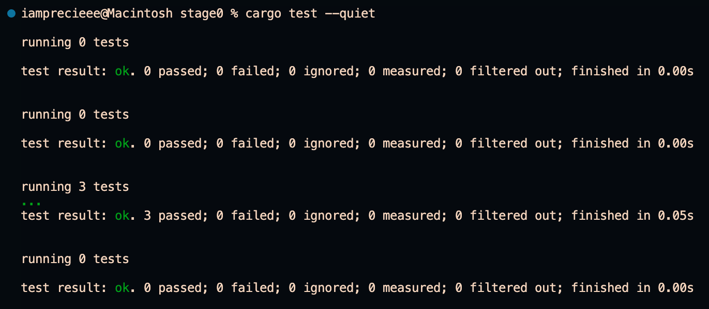

# HNG Stage 0 Backend API

A simple REST API built with Rust and Axum that serves user profile information along with arandom cat fact.

## Features

- RESTful API endpoint for fetching user profiles
- Integration with external cat facts API
- CORS support for cross-origin requests
- IP-based rate limiting (20 requests per minute per IP)
- Swagger UI documentation
- Comprehensive error handling with fallback mechanisms
- Full test coverage with mock server integration

## Dependencies

This project uses the following Rust crates:

- **axum** - Web framework
- **tokio** - Async runtime
- **reqwest** - HTTP client with JSON support
- **serde** and **serde_json** - Serialization/deserialization
- **tower** and **tower-http** - Middleware utilities (CORS)
- **utoipa** and **utoipa-swagger-ui** - OpenAPI/Swagger UI integration
- **chrono** - Date and time handling
- **dotenvy** - Environment variable loading
- **anyhow** - Error handling
- **tracing** and **tracing-subscriber** - Logging implementation
- **wiremock** - HTTP mocking for tests
- **dashmap** - Concurrent hash map for rate limiting

## Prerequisites

- Rust
- Cargo (comes with Rust)

## Installation

1. Clone the repository:
```bash
git clone <repository-url>
cd stage0
```

2. Install dependencies:
```bash
cargo build
```

All dependencies will be automatically downloaded and compiled by Cargo.

## Environment Variables

Create a `.env` file in the project root with the following variables:

```env
SERVER_HOST=0.0.0.0
SERVER_PORT=8000
CORS_ALLOWED_ORIGINS=http://localhost:3000,http://localhost:8000,https://catfact.ninja/fact
CAT_FACT_API=https://catfact.ninja/fact
EMAIL=your.email@example.com
FULL_NAME=Your Full Name
STACK=Rust
```

## Running Locally

1. Ensure your `.env` file is properly configured

2. Run the development server:
```bash
cargo run
```

3. The server will start on the configured host and port (default: http://0.0.0.0:8000)

4. Access the API:
   - Profile endpoint: http://localhost:8000/me
   - Swagger UI: http://localhost:8000/swagger-ui

## Running Tests

Execute the test suite:
```bash
cargo test
```

Run tests with output:
```bash
cargo test -- --show-output
```

Run tests in quiet mode:
```bash
cargo test --quiet
```

### Test result sample


## API Documentation

### Endpoint: GET /me

Returns user profile information along with a random cat fact.

**Response:**
```json
{
  "status": "success",
  "user": {
    "email": "your.email@example.com",
    "name": "Your Full Name",
    "stack": "Rust"
  },
  "timestamp": "2025-10-15T12:34:56.789Z",
  "fact": "Cats are mammals."
}
```

**Status Codes:**
- 200 OK - Request successful
- 429 Too Many Requests - Rate limit exceeded (20 requests per minute)

### Interactive Documentation

Visit http://localhost:8000/swagger-ui after starting the server for interactive API documentation where you can test endpoints directly from your browser.

## Project Structure

```
src/
├── main.rs          # Application entry point
├── lib.rs           # Library exports and constants
├── api.rs           # API router and app config
├── config.rs        # Environment config
├── routes.rs        # Request handlers
├── dtos.rs          # Data transfer objects
└── utils.rs         # Utility functions

tests/
└── lib.rs           # Integration tests
```

## Error Handling

The application implements robust error handling:
- External API failures gracefully fall back to a default cat fact
- Configuration errors are logged with appropriate error messages
- Server startup errors are caught and reported
- All errors avoid exposing sensitive internal details

## Rate Limiting
The API implements IP-based rate limiting to prevent abuse:

- Limit: 20 requests per minute per IP address
- Response: HTTP 429 (Too Many Requests) when limit exceeded
- Window: 60-second sliding window that resets automatically
- Tracking: Uses in-memory tracking via DashMap for thread-safe concurrent access

## Development

Build for release:
```bash
cargo build --release
```

### Docker Deployment
1. Build the Docker image:
```bash
docker build -t <project_name> .
```

2. Run the Docker container:
```bash
docker run -p 8000:8000 -e RUST_LOG=info -e SERVER_HOST=0.0.0.0 -e SERVER_PORT=8000 <project_name>
```

The application will be accessible at http://localhost:8000.

## License

This project is part of the HNG Internship program.